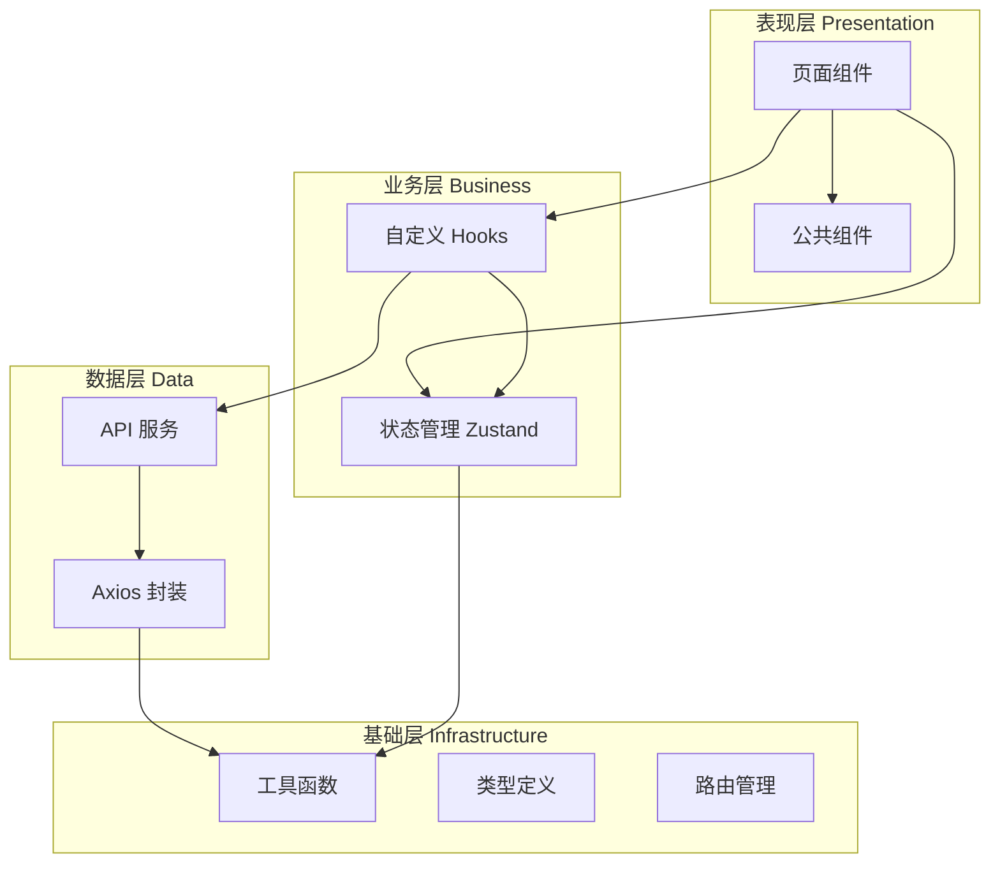

# Design Document

## Overview

本设计文档描述 H5 条码打印系统的技术架构和实现方案。系统采用 React 18 + TypeScript + Vite 技术栈，使用 Ant Design Mobile 5.x 作为 UI 组件库，Zustand 进行状态管理，React Router v6 进行路由管理。

项目遵循企业级前端架构标准，具备清晰的目录结构、统一的代码规范、完善的工具封装，支持多环境配置和快速业务迭代。

## Architecture

### 技术栈

| 类别 | 技术选型 | 版本 |
|------|----------|------|
| 构建工具 | Vite | 5.x |
| 前端框架 | React | 18.x |
| 类型系统 | TypeScript | 5.x |
| UI 组件库 | Ant Design Mobile | 5.x |
| 状态管理 | Zustand | 4.x |
| 路由管理 | React Router | 6.x |
| HTTP 客户端 | Axios | 1.x |
| 扫码库 | html5-qrcode | 2.x |
| CSS 方案 | Less + CSS Modules | - |

### 项目结构

```
src/
├── assets/                 # 静态资源
│   ├── images/            # 图片资源
│   └── icons/             # 图标资源
├── components/            # 公共组件
│   ├── NavBar/           # 导航栏组件
│   ├── Empty/            # 空状态组件
│   ├── Loading/          # 加载组件
│   ├── PageContainer/    # 页面容器组件
│   └── Scanner/          # 扫码组件
├── hooks/                 # 自定义 Hooks
│   ├── useAuth.ts        # 认证相关
│   ├── useRequest.ts     # 请求相关
│   └── useScanner.ts     # 扫码相关
├── pages/                 # 页面组件
│   ├── Login/            # 登录页
│   ├── Home/             # 首页
│   ├── Scan/             # 扫码页
│   ├── ScanResult/       # 扫码结果页
│   ├── PrintBody/        # 打印本体码
│   ├── PrintInner/       # 打印内包装码
│   └── PrintLabel/       # 打印收货外标签
├── services/              # API 服务
│   ├── request.ts        # Axios 封装
│   ├── auth.ts           # 认证接口
│   ├── printer.ts        # 打印机接口
│   └── barcode.ts        # 条码接口
├── stores/                # 状态管理
│   ├── userStore.ts      # 用户状态
│   └── printerStore.ts   # 打印机状态
├── styles/                # 全局样式
│   ├── variables.less    # 样式变量
│   ├── mixins.less       # 样式混入
│   └── global.less       # 全局样式
├── types/                 # 类型定义
│   ├── api.ts            # API 类型
│   ├── user.ts           # 用户类型
│   └── printer.ts        # 打印机类型
├── utils/                 # 工具函数
│   ├── storage.ts        # 存储工具
│   ├── format.ts         # 格式化工具
│   ├── validate.ts       # 验证工具
│   └── url.ts            # URL 工具
├── router/                # 路由配置
│   ├── index.tsx         # 路由入口
│   └── AuthRoute.tsx     # 路由守卫
├── App.tsx               # 应用入口
├── main.tsx              # 主入口
└── vite-env.d.ts         # Vite 类型声明
```

### 架构图



## Components and Interfaces

### 1. HTTP 请求封装 (services/request.ts)

```typescript
interface RequestConfig extends AxiosRequestConfig {
  skipAuth?: boolean;      // 跳过认证
  skipErrorHandler?: boolean; // 跳过错误处理
}

interface ApiResponse<T = any> {
  code: number;
  data: T;
  message: string;
}

interface RequestInstance {
  get<T>(url: string, config?: RequestConfig): Promise<T>;
  post<T>(url: string, data?: any, config?: RequestConfig): Promise<T>;
  put<T>(url: string, data?: any, config?: RequestConfig): Promise<T>;
  delete<T>(url: string, config?: RequestConfig): Promise<T>;
}
```

### 2. 存储工具 (utils/storage.ts)

```typescript
interface StorageService {
  get<T>(key: string): T | null;
  set<T>(key: string, value: T): void;
  remove(key: string): void;
  clear(): void;
}
```

### 3. 用户状态管理 (stores/userStore.ts)

```typescript
interface UserState {
  token: string | null;
  userInfo: UserInfo | null;
  isLoggedIn: boolean;
}

interface UserActions {
  setToken(token: string): void;
  setUserInfo(info: UserInfo): void;
  logout(): void;
}

type UserStore = UserState & UserActions;
```

### 4. 打印机状态管理 (stores/printerStore.ts)

```typescript
interface PrinterState {
  currentPrinter: Printer | null;
  printerList: Printer[];
}

interface PrinterActions {
  setCurrentPrinter(printer: Printer): void;
  setPrinterList(list: Printer[]): void;
}

type PrinterStore = PrinterState & PrinterActions;
```

### 5. 公共组件接口

```typescript
// NavBar 组件
interface NavBarProps {
  title: string;
  showBack?: boolean;
  onBack?: () => void;
  right?: React.ReactNode;
}

// Empty 组件
interface EmptyProps {
  image?: string;
  description?: string;
  children?: React.ReactNode;
}

// Loading 组件
interface LoadingProps {
  loading: boolean;
  fullscreen?: boolean;
  children?: React.ReactNode;
}

// PageContainer 组件
interface PageContainerProps {
  title: string;
  showBack?: boolean;
  right?: React.ReactNode;
  children: React.ReactNode;
}
```

## Data Models

### 用户模型

```typescript
interface UserInfo {
  id: string;
  username: string;
  name: string;
  avatar?: string;
  role: string;
}

interface LoginParams {
  username: string;
  password: string;
}

interface LoginResult {
  token: string;
  userInfo: UserInfo;
}
```

### 打印机模型

```typescript
interface Printer {
  id: string;
  name: string;
  ip: string;
  port: number;
  status: 'online' | 'offline' | 'busy';
  type: 'body' | 'inner' | 'label';
}
```

### 条码模型

```typescript
interface BarcodeInfo {
  id: string;
  code: string;
  type: 'body' | 'inner' | 'label';
  productName: string;
  productCode: string;
  createTime: string;
}

interface PrintTask {
  id: string;
  barcodeId: string;
  printerId: string;
  quantity: number;
  status: 'pending' | 'printing' | 'success' | 'failed';
  createTime: string;
}
```

### 标签模型

```typescript
interface LabelInfo {
  productCode: string;
  productName: string;
  batchNo: string;
  quantity: number;
  unit: string;
  productionDate: string;
  expiryDate?: string;
  supplier?: string;
}
```


## Correctness Properties

*A property is a characteristic or behavior that should hold true across all valid executions of a system-essentially, a formal statement about what the system should do. Properties serve as the bridge between human-readable specifications and machine-verifiable correctness guarantees.*

基于需求分析，以下是系统需要满足的正确性属性：

### Property 1: Storage 工具存取一致性（Round-Trip）

*For any* 有效的键值对数据，存储后再读取应该返回相同的数据

**Validates: Requirements 12.1**

### Property 2: 日期格式化正确性

*For any* 有效的 Date 对象和格式字符串，格式化后的字符串应该包含正确的年、月、日信息

**Validates: Requirements 12.2**

### Property 3: 验证工具正确性 - 手机号验证

*For any* 符合中国大陆手机号格式的字符串（1开头，11位数字），验证函数应返回 true；对于不符合格式的字符串应返回 false

**Validates: Requirements 12.3**

### Property 4: 验证工具正确性 - 条码格式验证

*For any* 符合条码格式规则的字符串，验证函数应返回 true；对于不符合格式的字符串应返回 false

**Validates: Requirements 7.2, 12.3**

### Property 5: URL 参数解析/构建一致性（Round-Trip）

*For any* 有效的参数对象，构建 URL 查询字符串后再解析应该返回等价的参数对象

**Validates: Requirements 12.4**

### Property 6: 用户状态管理一致性

*For any* 有效的用户信息和 Token，设置到 userStore 后读取应该返回相同的数据

**Validates: Requirements 13.2**

### Property 7: 打印机状态管理一致性

*For any* 有效的打印机信息，设置到 printerStore 后读取应该返回相同的数据

**Validates: Requirements 4.3, 13.3**

### Property 8: 表单验证 - 空值检测

*For any* 仅包含空白字符的字符串（空格、制表符、换行符等），表单验证应该判定为空值

**Validates: Requirements 3.2**

### Property 9: 打印数量范围验证

*For any* 数量值，当值在 1-999 范围内时验证应通过，否则应失败

**Validates: Requirements 8.2**

### Property 10: 日期范围验证

*For any* 日期和给定的最小/最大日期范围，当日期在范围内时应可选，否则应禁用

**Validates: Requirements 10.4**

### Property 11: 请求拦截器 Token 注入

*For any* 已登录状态下的 HTTP 请求，请求头中应包含正确的 Authorization Token

**Validates: Requirements 2.2**

### Property 12: 搜索结果列表渲染

*For any* 非空的搜索结果数组，渲染后的列表项数量应等于数组长度

**Validates: Requirements 6.1**

## Error Handling

### 网络错误处理

| 错误类型 | 处理方式 |
|----------|----------|
| 网络超时 | 显示"网络超时，请检查网络连接"提示 |
| 服务器错误 (5xx) | 显示"服务器繁忙，请稍后重试"提示 |
| 请求错误 (4xx) | 根据具体状态码显示对应错误信息 |
| 401 未授权 | 清除本地 Token，跳转登录页 |
| 403 禁止访问 | 显示"无权限访问"提示 |
| 404 未找到 | 显示"资源不存在"提示 |

### 业务错误处理

```typescript
// 统一错误处理函数
const handleError = (error: ApiError) => {
  switch (error.code) {
    case 'LOGIN_FAILED':
      Toast.show('用户名或密码错误');
      break;
    case 'PRINTER_OFFLINE':
      Toast.show('打印机离线，请检查连接');
      break;
    case 'BARCODE_INVALID':
      Toast.show('条码格式无效');
      break;
    case 'PRINT_FAILED':
      Dialog.alert({
        title: '打印失败',
        content: error.message,
        confirmText: '重试',
      });
      break;
    default:
      Toast.show(error.message || '操作失败');
  }
};
```

### 表单验证错误

- 实时验证：输入时即时反馈
- 提交验证：提交前完整校验
- 错误高亮：红色边框 + 错误提示文字

## Testing Strategy

### 测试框架选择

| 类型 | 框架 | 用途 |
|------|------|------|
| 单元测试 | Vitest | 工具函数、状态管理测试 |
| 属性测试 | fast-check | 正确性属性验证 |
| 组件测试 | React Testing Library | 组件渲染和交互测试 |

### 单元测试策略

1. **工具函数测试**
   - Storage 工具的 CRUD 操作
   - 日期格式化函数的各种格式
   - 验证函数的边界情况
   - URL 参数处理函数

2. **状态管理测试**
   - userStore 的状态变更
   - printerStore 的状态变更
   - 状态持久化功能

3. **组件测试**
   - 公共组件的渲染
   - 表单组件的验证逻辑
   - 页面组件的基本功能

### 属性测试策略

使用 fast-check 库进行属性测试，每个属性测试运行至少 100 次迭代。

测试文件命名规范：`*.property.test.ts`

每个属性测试必须包含注释引用设计文档中的属性编号：
```typescript
// **Feature: h5-barcode-print-system, Property 1: Storage 工具存取一致性**
```

### 测试覆盖目标

- 工具函数：90% 以上覆盖率
- 状态管理：80% 以上覆盖率
- 公共组件：70% 以上覆盖率
